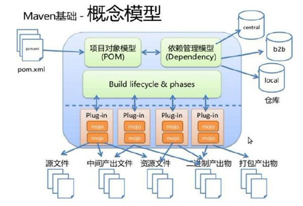
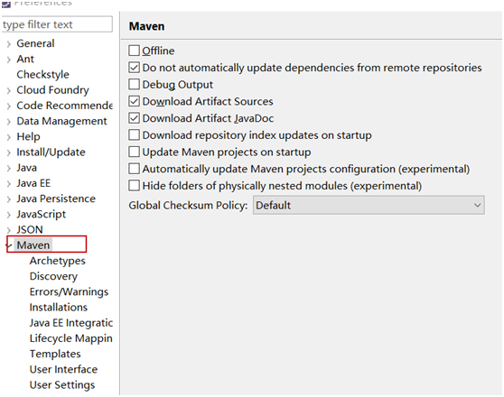
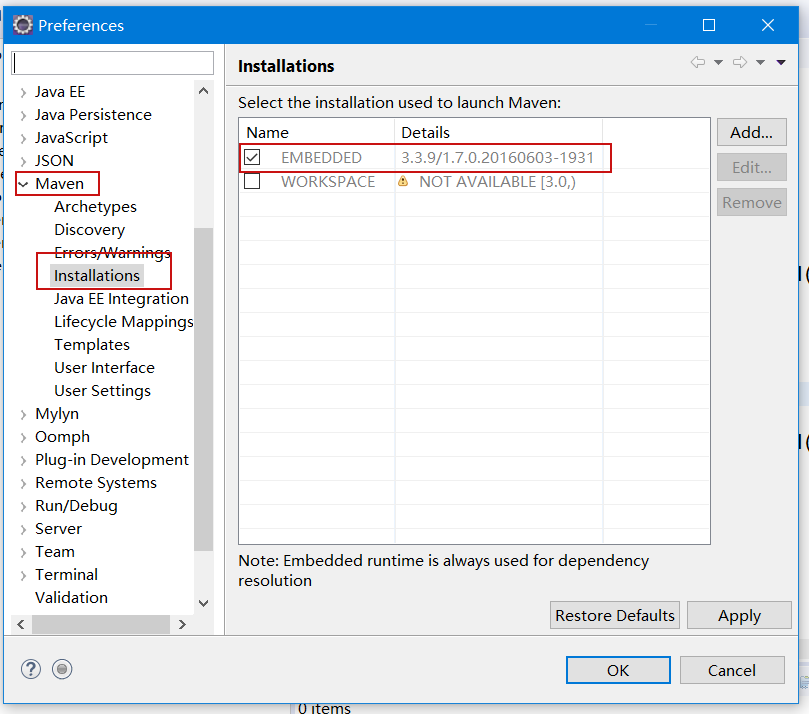
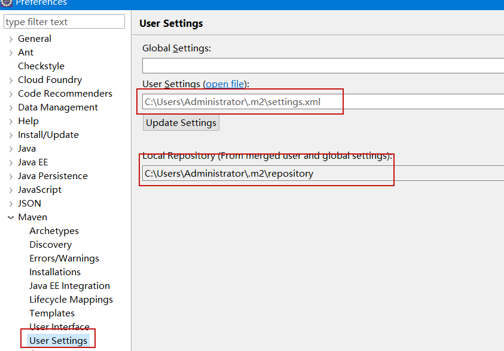

# Maven 的基本使用


## 零、基本概念

Maven 是基于项目对象模型（POM），可以通过一小段描述信息来管理项目的构建，报告和文档的软件项目管理工具。

Maven 主要有两个功能：

> 1. 项目构建
> 2. 依赖管理




## 一、Maven in 5 Minutes

### 1. 安装 Maven

1. 下载解压 maven 压缩包（<small>*http://maven.apache.org/*</small>）
2. 配置环境变量

`前提`，需要安装 java 。

在命令行执行如下命令：

```bash
mvn --version
```

如出现类似如下结果，则证明 maven 安装正确/成功。

```bash
Apache Maven 3.5.0 (ff8f5e7444045639af65f6095c62210b5713f426; 2017-04-04T03:39:06+08:00)
Maven home: D:\Program Files\apache-maven-3.5.0\bin\..
Java version: 1.8.0_144, vendor: Oracle Corporation
Java home: C:\Program Files\Java\jdk1.8.0_144\jre
Default locale: zh_CN, platform encoding: GBK
OS name: "windows 10", version: "10.0", arch: "amd64", family: "windows"
```

### 2. 创建项目

在你所期望建立项目的文件路径下，执行如下命令

```bash
mvn archetype:generate -DgroupId=com.mycompany.app -DartifactId=my-app -DarchetypeArtifactId=maven-archetype-quickstart -DinteractiveMode=false
```

这条命令会在当前目录下，新建一个名字与 `artifactId` 值相同的 Maven 项目。    

其项目目录结构如下：

```
my-app
│── pom.xml
└── src
    ├── main
    │   └── java
    │       └── com
    │           └── mycompany
    │               └── app
    │                   └── App.java
    └── test
        └── java
            └── com
                └── mycompany
                    └── app
                        └── AppTest.java
```

注意，maven 项目有固定的目录结构，与开发工具无关。无论使用 Eclipse（及其派生工具）还是 Intellij Idea 都是如上的目录结构。

### 3. POM 文件

pom 文件是 maven 项目的核心文件，中包含了：

> - 项目基本信息（General Project Information）
> - 构建环境（Build Environment）
> - POM 关系管理（POM Relationships）
> - 构建设置（Build Settings）

对于 pom 文件中的各个设置，后续详细讲解。

### 4. 构建项目

生成项目的最终 jar 包非常简单，仅需在 Maven 项目下执行：

```
mvn package
```

### 5. 基本配置

Maven 有两个 **`settings.xml`** 配置文件，一个是全局性配置文件，一个是用户个人配置文件。

**`%MAVEN_HOME%/conf/settings.xml`** 是 maven 全局的配置文件。该配置文件中配置了本地仓库的路径，默认就是：**`~/.m2/repository`** 。其中 **`~`** 表示当前用户路径 **`C:\Users\[UserName]`** 。

**`~/.m2/settings.xml`** 是用户的配置文件（默认没有该文件，需要将全局配置文件拷贝过来在进行修改）。

## 二、Maven 命令

在使用终端时，Maven 命令需要在 pom.xml 所在目录中执行以下命令。

- mvn compile
  - 执行 `mvn compile` 命令，完成编译操作
  - 执行完毕后，会生成 `target` 目录，该目录中存放了编译后的字节码文件（.class文件）。

- mvn clean
  - 执行 `mvn clean` 命令，完成清理操作。
  - 执行完毕后，会将 target 目录删除。

- mvn test
  - 执行 `mvn test` 命令，完成单元测试操作
  - 执行完毕后，会在 target 目录中生成三个文件夹：surefire、surefire-reports（测试报告）、test-classes（测试的字节码文件）。

- mvn package
  - 执行 `mvn package` 命令，完成打包操作
  - 执行完毕后，会在 target 目录中生成一个文件，该文件可能是 jar、war 。

- mvn clean compile
  - 组合指令，等价于先后执行：`mvn clean` 和 `mvn compile` 。通常应用于上线前执行，清除测试类

- mvn clean test
  - 组合指令，等价于先后执行：`mvn clean` 和 `mvn test`，通常应用于测试环节。


## 三、Eclipse 中使用 Maven

在最近的版本中，Eclipse 已经内置了 **M2Eclipse** 插件，因此能够在 Eclipse中 直接使用 Maven 。

查看 eclipse 中是否有 maven 插件





设置用户配置



通过骨架（archetype）创建 maven 工程

第一步：选择 new → maven → Maven Project
第二步：`New Maven Project` 窗口不作任何设置，直接 Next 。
第三步：选择 maven 的工程骨架，这里我们选择 quickstart ，点击 Next 。
第四步：输入 GroupId、ArtifactId、Version、Package 信息点击 finish完成。


## 四、Maven 核心概念

### 1. 坐标

在 maven 中坐标就是为了定位一个唯一确定的 jar 包。坐标的组成部分有：

> - groupId：定义当前Maven组织名称
> - artifactId：定义实际项目名称
> - version：定义当前项目的当前版本

### 2. 依赖管理

依赖管理就是对项目中 jar 包的管理。可以在 pom 文件中定义 jar 包的坐标，管理依赖。

依赖声明主要包含如下元素：

```xml
<dependencies>

    <dependency>
        <groupId>junit</groupId>
        <artifactId>junit</artifactId>
        <version>4.11</version>
        <scope>test</scope>
    </dependency>

    <dependency>...</dependency>	
    <dependency>...</dependency>	

</dependencies>
```

### 3. 依赖范围

| 依赖范围（Scope） | 对主代码 ClassPath 有效 | 对测试代码 ClassPat h有效| 被打入 jar/war 包中 | 例子 |
| :------- | :-: | :-: | :-: | :---- |
| compile  | Yes | Yes | Yes | log4j |
| test     | -   | Yes | -   | junit |
| privided | Yes | Yes | -   | servlet-api   |
| runtime  | -   | -   | Yes | jdbc 驱动实现类 |

### 4. 依赖传递和依赖冲突

### 5. 生命周期

Maven 生命周期就是为了对所有的构建过程进行抽象和统一。这个过程分为三个独立阶段（也叫生命周期）：

- **Clean** <small>Lifecycle</small>：在进行真正的构建之前进行一些清理工作。
- **Default** <small>Lifecycle</small>：构建的核心部分，编译，测试，打包，部署等等。
- **Site** <small>Lifecycle</small>：生成项目报告，站点，发布站点。

这三个阶段是相互独立的，这意味着，你可以仅仅调用 clean 来清理工作目录，仅仅调用 site 来生成站点。当然你也可以直接运行 mvn clean install site 运行所有这三套生命周期。

三个阶段中，**Default** <small>Lifecycle</small> 是核心。

这三个阶段，每个阶段中又各自分为不同的小步骤。当执行某一个小步骤时，它之前的小步骤都会被执行。**Default** <small>Lifecycle</small> 中包含了几十个小步骤，其中重要和常用的步骤（先后顺序）是：

- ...
- **compile**: <small>编译项目的源代码。</small>
- ...
- **test**: <small>使用合适的单元测试框架运行测试。这些测试代码不会被打包或部署。</small>
- ...
- **package**: <small>接受编译好的代码，打包成可发布的格式，如 JAR 。</small>
- ...
- **install**: <small>将包安装至本地仓库，以让其它项目依赖。 </small>
- ...

## 五、插件

Maven 本质上是一个插件的框架/平台。

例如：

- `mvn compile` 这个命令，就是由 `maven-compiler-plugin` 插件完成的。
- `mvn test` 这个命令，就是由 `maven-surefire-plugin` 插件完成的。
- `mvn package` 这个命令，就是由 `maven-jar-plugin` / `maven-war-plugin` 插件完成的。

Compile 插件

```xml
<build>
    <plugins>
        <plugin>
            <groupId>org.apache.maven.plugins</groupId>
            <artifactId>maven-compiler-plugin</artifactId>
            <configuration>
                <source>1.8</source>
                <target>1.8</target>
                <encoding>UTF-8</encoding>
            </configuration>
        </plugin>

        <plugin>...</plugin>
        <plugin>...</plugin>
    <plugins>
</build>
```

Maven 除了内置/自带的插件外，还可以“安装”第三方插件。任何一个 Maven 动作都是交由具体的插件去完成的。

### 1. maven-assembly-plugin 插件

> 该插件是针对 jar 包打包。war 包使用 `mvn package` 命令时，在 WEB-INF 下的 lib 下会自动加入所依赖的 jar 包。

maven 打包生成普通 jar 时，只会包含工程下源码编译结果，不包含 pom.xml 里依赖的 jar，如需加入项目依赖的 jar 文件，可使用 `maven-assembly-plugin` 插件，使用方式如下：

- 在 pom.xml中 添加 maven-assembly-plugin 插件

    ```xml
    <plugins>
        ...
        <plugin>  
            <artifactId>maven-assembly-plugin</artifactId>  
            <configuration>  
                <descriptorRefs>  
                    <descriptorRef>jar-with-dependencies</descriptorRef>  
                </descriptorRefs>  
            </configuration>
        </plugin>
        ...
    </plugins>
    ```

- 在 pom.xml 同级目录下打开命令行执行如下命令：

  > mvn assembly:assembly

执行成功后会在 target 文件夹下多出一个以 `-jar-with-dependencies.jar` 结尾的 jar 包，这个 jar 包就包含了项目依赖的所有 jar 的 class 文件。

如果不希望依赖的 JAR 包变成 CLASS （而是以 .jar 包的方式存在）,可以修改ASSEMBLY 插件.

- 找到 assembly 在本地的地址，一般是 `.m2\repository\org\apache\maven\plugins\maven-assembly-plugin`

- 用 WINZIP 或解压工具打开此目录下的 maven-assembly-plugin-xxx.jar, 找到 `assemblies\jar-with-dependencies.xml`

- 把里面的 UNPACK 改成 FALSE


### 2. Tomcat 7 插件

```xml
<build>
    <plugins>
        <plugin>
            <!-- 配置插件 -->
            <groupId>org.apache.tomcat.maven</groupId>
            <artifactId>tomcat7-maven-plugin</artifactId>
            <version>2.2</version>
            <configuration>
                <port>8080</port>
                <path>/mycontext</path>
                <uriEncoding>UTF-8</uriEncoding>
                </configuration>
        </plugin>
        <plugin>...</plugin>
        <plugin>...</plugin>
    <plugins>
</build>
```

## 六、Maven 仓库管理

用来统一存储所有Maven共享构建的位置就是 Maven 仓库。


Maven 仓库分为

- 本地仓库
`~/.m2/repository`
每个用户只有一个本地仓库

- 远程仓库
    - 中央仓库：Maven默认的远程仓库 `http://repo1.maven.org/maven2`
    - 私服：是一种特殊的远程仓库，它是架设在局域网内的仓库


以下网站可查询每个项目的坐标

```xml
https://mvnrepository.com/
https://maven.aliyun.com/mvn/search
```

---

中央服务器设置（修改 settings.xml 配置文件）

```xml
<mirrors>
    <mirror>
        <id>alimaven</id>
        <name>aliyun maven</name>
        <url>http://maven.aliyun.com/nexus/content/repositories/central/</url>
        <mirrorOf>central</mirrorOf>
    </mirror>
</mirrors>
```

## 六、其他

Maven 默认使用 JDK 1.4 的语法。如要修改默认的语法校验标准，一劳永逸的办法是修改 setting.xml 配置文件。在 `<profiles>` 元素下添加子元素

```xml
<profile>
    <id>jdk-1.8</id>
    <activation>
        <activeByDefault>true</activeByDefault>
        <jdk>1.8</jdk>
    </activation>
    <properties>
        <maven.compiler.source>1.8</maven.compiler.source>
        <maven.compiler.target>1.8</maven.compiler.target>
        <maven.compiler.compilerVersion>1.8</maven.compiler.compilerVersion>
    </properties>
</profile>
```

