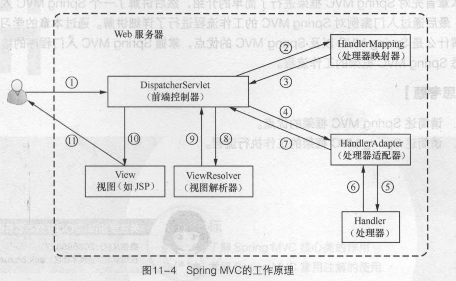

如上图，Spring MVC 程序的完整执行流程如下：

1. 用户通过浏览器发送请求，请求会被 Spring MVC 的前端控制器 DispatcherServler 接受。

2. DispatcherServlet 拦截到请求后，会调用 HandlerMapping 处理器映射器。

3. 处理器映射器根据请求 URL 找到具体的处理器，生成处理器对象（如果有，还会生成拦截器对象）并返回给 DispatcherServlet。

4. DispatcherServlet 根据返回信息（Handler）选择合适的处理器适配器（HandlerAdapter）。

5. HandlerAdapter 会调用并指定 Handler（处理器）。此处和上述所说的处理器 Handler，就是我们所编写的 Controller 类。

6. Controller 执行完成后，会返回一个 ModelAndView 对象，该对象中会包含视图名和模型对象。

7. HandlerAdapter 将 ModelAndView 返回给 DispatcherServlet。

8. DispatcherServlet 会根据返回信息（ModelAndView）选择一个合适的视图解析器：ViewResolver。

9. 视图解析器 ViewResolver 解析视图后，会向 DispatcherServlet 返回具体的 View 对象。

10. DispatcherServlet 对 View 进行渲染。即，将模型数据填充至视图中。

11. DispatcherServlet 将渲染后的结果返回/发送给客户端浏览器。

在上述执行过程中，DispatcherServlet、HandlerMapping、HandlerAdapter 和 ViewResolver 对象的工作都是在框架内部执行的，开发人员并不需要关心这些对象内部实现过程。
